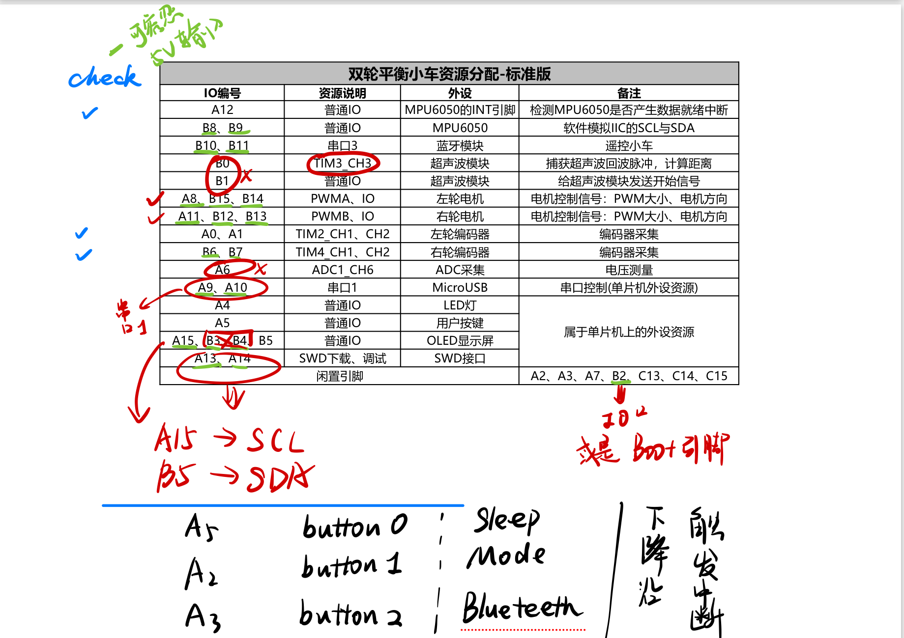

# Godzilla 第三次组会备忘录

## 2025/03/16 星期六

### 代码层面的技术文档说明

1. 端口资源配置

    

介绍： 

**主要用到的外设：**

​	三个按钮键 主要用于中断设置标志位，以控制小车。

​	OLED 显示屏： 只用两个端口即可 只要是用于调试与显示目前状态。

​	电机与驱动 每一个电机需要两个接口实现控制方向  一个接口输出PWM 波形控制速度。

​	MPU6050 通过两个接口软件模拟IIC 通信 输出加速度与角速度，通过INT接口输出5ms的时钟实现定时中断

​	LED 实现赛题要求

**主要功能**：

​	主函数初始化LED输出，并依据标志位控制OLED输出

​	按钮开启中断，实现标志位的修改

​	INT 中断实现控制

### 面包板搭建验证代码可行性

前去实验室 借用示波器测量

### 搭建小车基本结构

### 讨论后续事宜

1. PCB 板设计 
2. 蓝牙模块设计